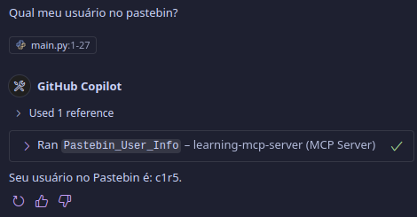
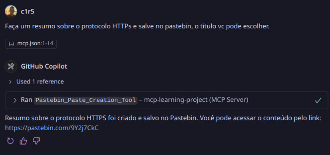

# MCP Learning

Este projeto é um ambiente de aprendizado focado no desenvolvimento e experimentação com servidores MCP (Model Context Protocol) utilizando Python. O objetivo principal é explorar conceitos, práticas e ferramentas modernas de desenvolvimento backend, promovendo o estudo contínuo e a aplicação de novos conhecimentos.

## Objetivos

- Aprender sobre arquitetura de servidores MCP
- Praticar a organização de projetos Python
- Experimentar integrações e módulos auxiliares
- Desenvolver habilidades em testes automatizados

## Funcionalidades já desenvolvidas

- **MCP do Pastebin**: Implementação de um módulo para integração e manipulação de dados do Pastebin, incluindo funções auxiliares e testes automatizados para garantir o correto funcionamento.
  - **Tool para obter informações do usuário**: Ao solicitar informações do perfil no pastebin, a tool é invocada e o processo é realizado retornando as informações pedidas.
  
  - **Tool de Criação de Pastes no Pastebin**: Permite criar pastes programaticamente via API, com suporte a parâmetros como título, conteúdo, visibilidade e expiração.
  
  
## Observações

Este repositório é destinado exclusivamente para fins educacionais e experimentais. Sinta-se à vontade para explorar, modificar e contribuir para o seu próprio aprendizado.
